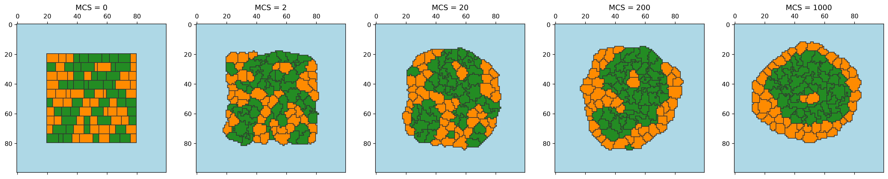
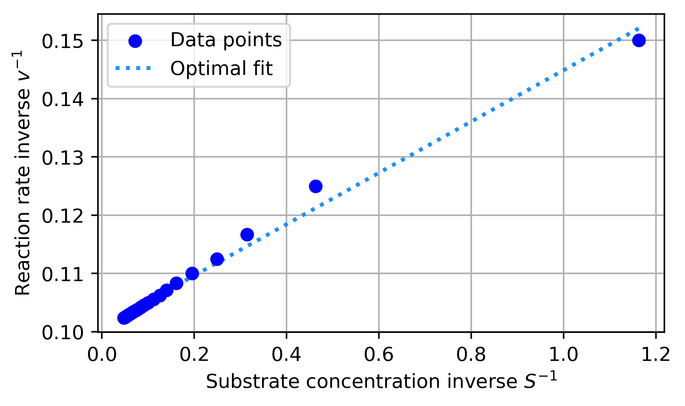
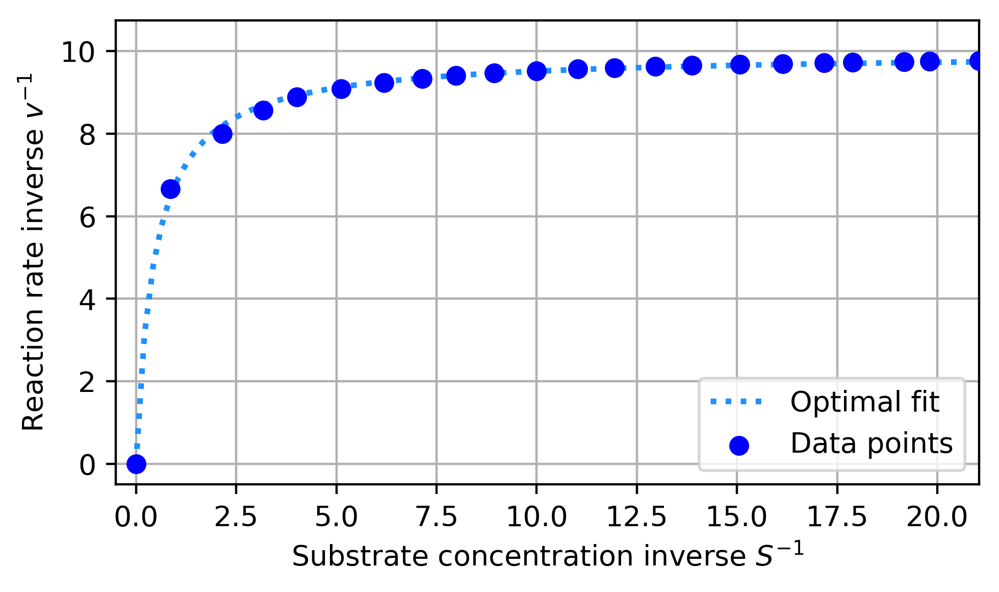
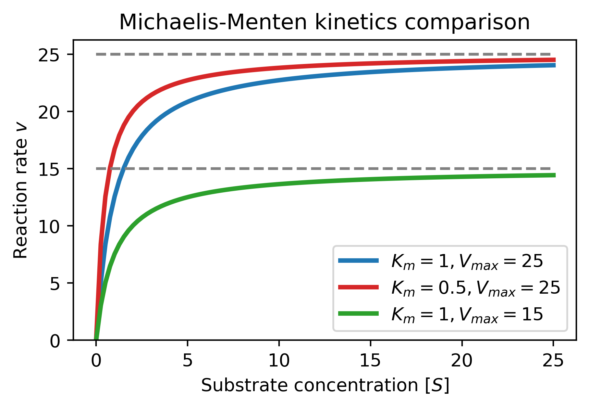

# Computational Biology

## Cell sorting (self-organization)

  

  

## Schnakenberg pattern formation through Turing system (Reaction-Diffusion)

  

## Rate Equation

  

## Michaelis Menten kinetics

  
  
  

Completed as assignments 1 through 5 for Master's course Computational Biology @ University of Amsterdam.